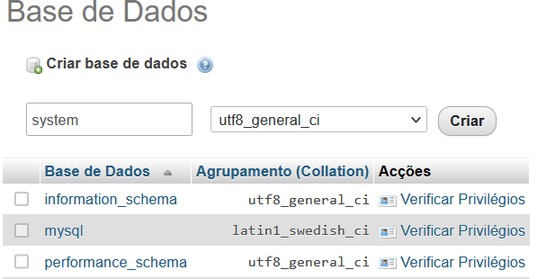
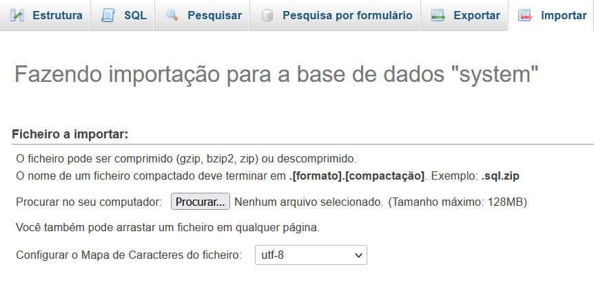
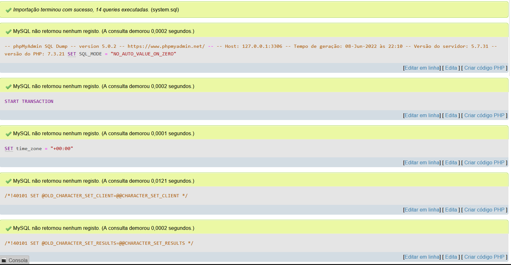

# Projeto CRUD

## Projeto feito, usando PHP e JS
 

#### Para pode testar o projeto siga as instruções para instalação do  banco

#### <li>**Wamp** / **Xamp**
> Na pasta www, crie uma raiz com o nome **Dash** e coloque todo o  projeto.

> Baixe o arquivo **system.sql** e importe para um banco de dados com   o mesmo nome

 
 

# Passo 1 

 

# Passo 2

 

# Passo 3

